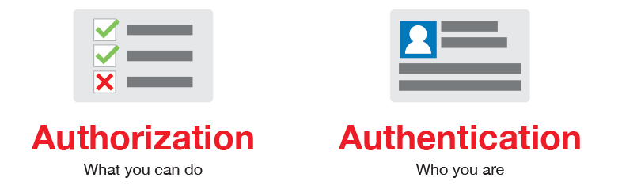
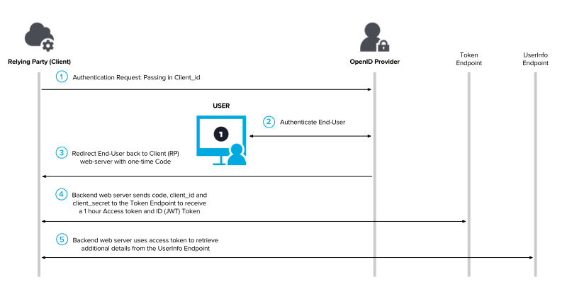

# Authentication and Authorization

## Introduction

First, following **security** concepts must be clarified:

- **Authentication** means verifying that someone is indeed **who** they claim to be.
- **Authorization** means deciding which **resources** a certain user should be able to access, and what they should be allowed to do with those resources. Usually, an application will require a little bit of both.

### OAuth/2

**OAuth 1** is an open standard for **access delegation**, commonly used as a way for Internet users to grant websites or applications access to their information on other websites but without giving them the passwords. This mechanism is used by companies such as Amazon, Google, Facebook, Microsoft and Twitter to permit the users to share information about their accounts with third party applications or websites.

**OAuth 2** is an **authorization** framework that enables applications to obtain limited access to user accounts on an HTTP service, such as Facebook, GitHub, and DigitalOcean. It works by delegating user authentication to the service that hosts the user account, and authorizing **third-party** applications to access the user account. OAuth 2 provides authorization flows for web and desktop applications, and mobile devices.

#### OAuth vs OAuth 2

Differences between **OAuth** and **Oauth2**

- Basically, OAuth 2 delegates security to the HTTPS protocol
- **Better** support for **non-browser** based applications. New ways for an application to get authorization for a user.
- **No** longer requires client applications to have **cryptography**.  The application can make a request using only the issued token over HTTPS.
- **Signatures** are much **less** complicated. No more special parsing, sorting, or encoding.
- Access tokens are **short-lived**. Created the notion of **refresh tokens**.
- Clean **separation** of **roles** between the server responsible for handling OAuth requests and the server handling user authorization.

### OpenID Connect

**OpenID 1.0/2.0** are **old** specifications for **authentication**. Those who made the specifications expected people to use OpenID for authentication. However, some people began to use **OAuth 2.0** for authentication (not for authorization) and OAuth authentication has prevailed rapidly. **OAuth2** is also the **basis** for OpenID Connect, which provides OpenID (**authentication**) on top of OAuth2 (**authorization**) for a more complete security solution.

## References

- [Spring Boot Security Oauth2 Jwt Auth ](https://www.devglan.com/spring-security/spring-boot-oauth2-jwt-example)
- [Spring boot secutiry Jwt MySQL](https://www.callicoder.com/spring-boot-spring-security-jwt-mysql-react-app-part-2/)
- [Spring Boot Security Jwt Authentication](https://www.devglan.com/spring-security/spring-boot-jwt-auth)
- [Using JWT with Spring Security OAuth](https://www.baeldung.com/spring-security-oauth-jwt)
- [Microservices authentication and authorization](https://medium.com/tech-tajawal/microservice-authentication-and-authorization-solutions-e0e5e74b248a)