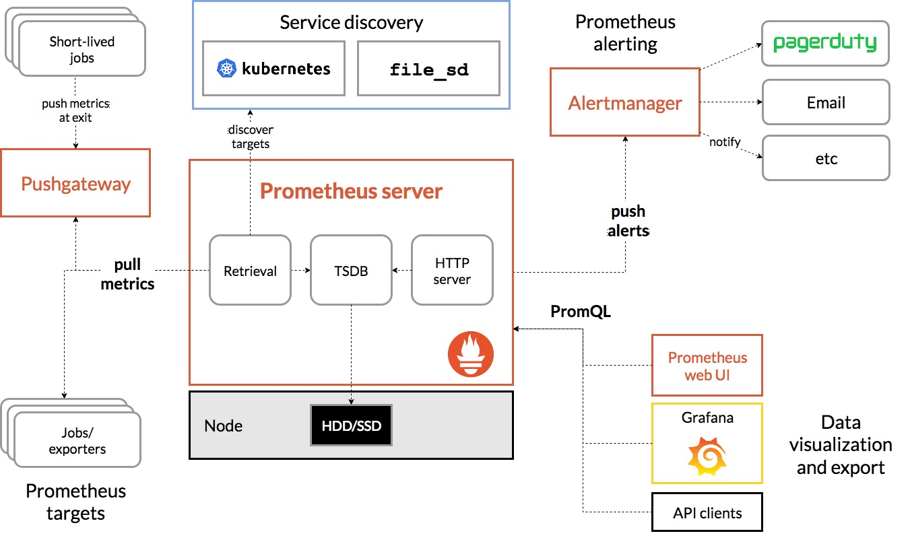
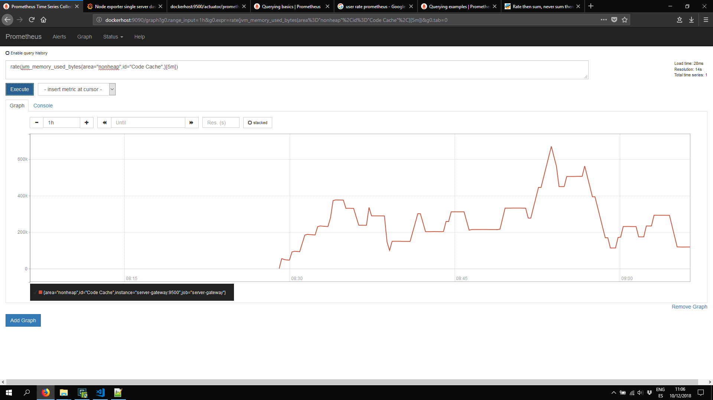
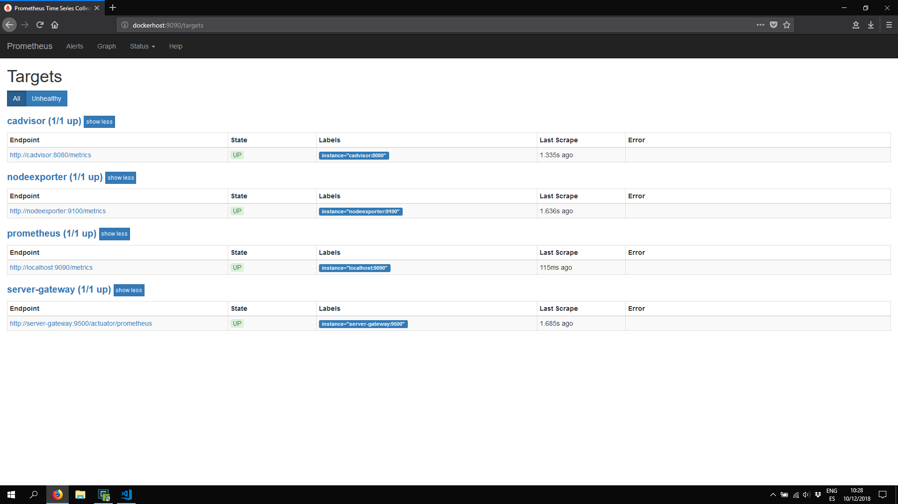
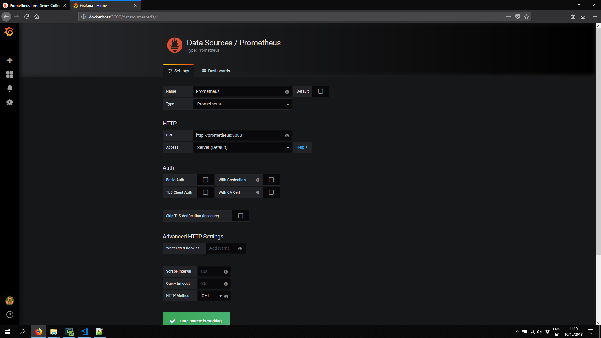
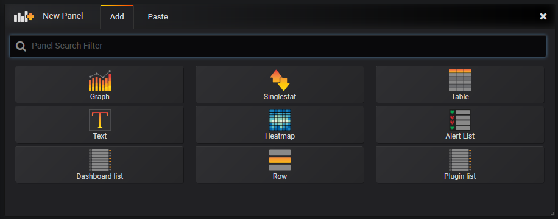
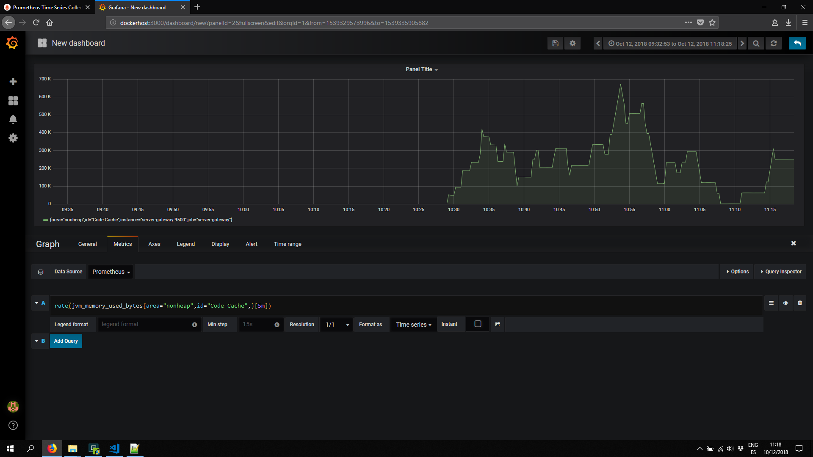
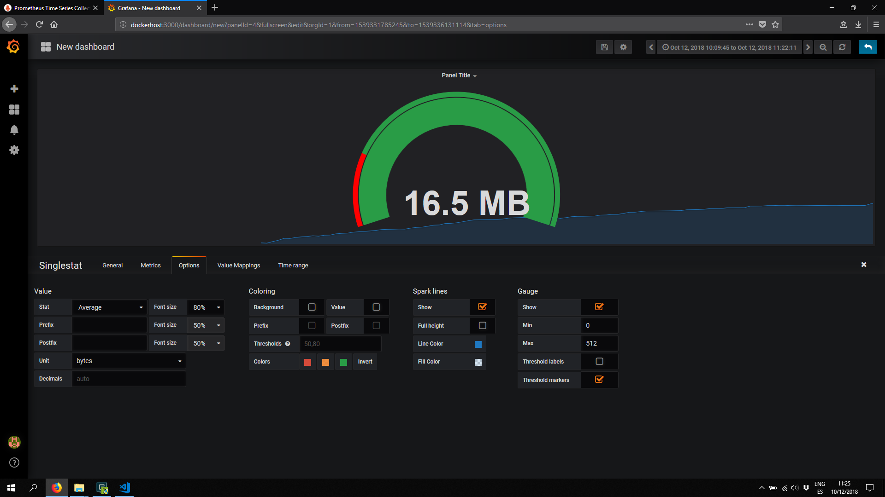
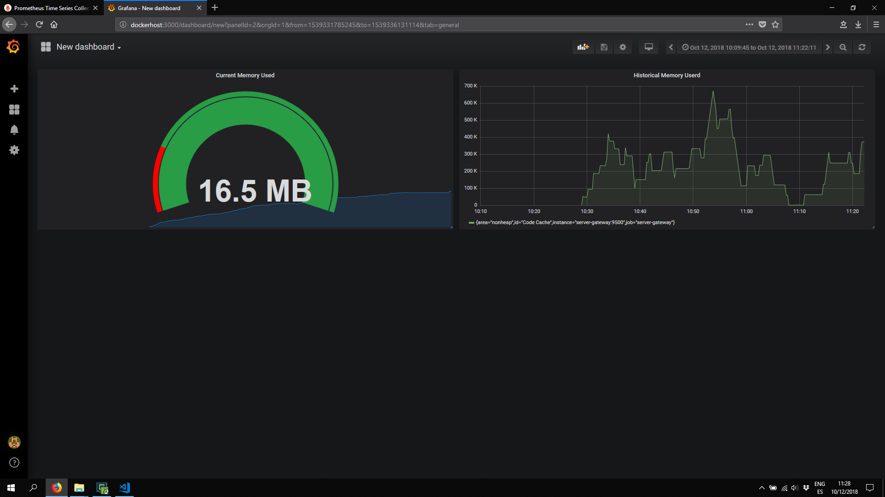
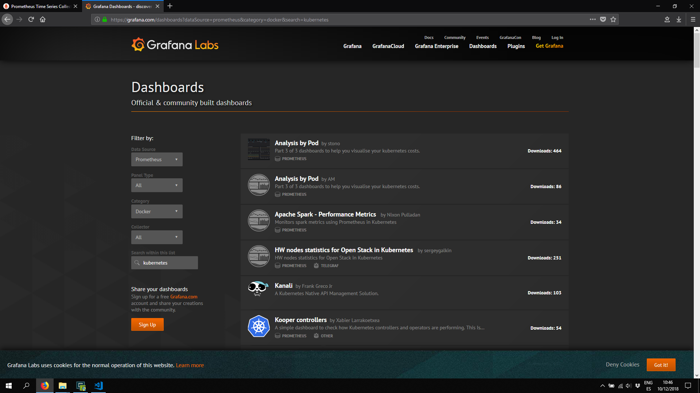
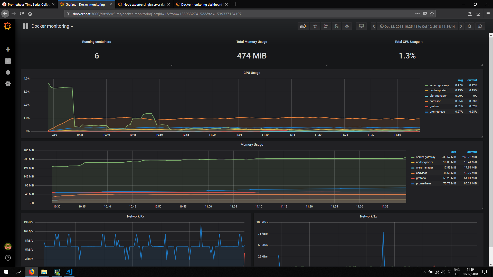

# MONITORING

## Introduction

While logs are about a **specific** event, **metrics** are a **measurement** at a point in time for the system. This unit of measure can have the value, timestamp, and identifier of what that value applies to (like a source or a tag). Logs may be collected any time an event takes place, but metrics are typically collected at **fixed-time** intervals. These are referred to as the **resolution**.

The collection of the data is referred to as a **time-series** metric. They can be visualized in different types of graphs such as **gauges**, **counters**, and **timers**.

Though a measurement of the health of the system can be stored in a performance log file, this method can be very costly to collect the health of the system. You’re basically creating a new entry constantly with all the metadata about the system to get a single number. A **metric** will normalize this so you aren’t logging the same data over and over. You’re only storing the **number** and **timestamp**. The metric will be a tiny fraction of the size of an entire log entry for these measurements.

### Logs vs Metrics

A log is an event that happened and a metric is a measurement of the health of a system.

Think of it this way. If you go to a doctor when you’re sick, you can tell her everywhere you went in the past week. You can mention things like you were at a food festival, your kid’s birthday party, and your office. If you give your doctor enough clues about your **history**, she may possibly be able to pinpoint your ailment exactly.

This would be the same as **troubleshooting** your system based completely on looking at **logs**.

To help her with coming up with a very confident conclusion about what is wrong and how to get better, she’ll need your vitals like blood **pressure**, **temperature**, **weight**, and possibly other **measurements** like blood samples. You will always have these measurements that can be taken whether you’re healthy or sick. These are the **equivalent** of the **metrics**.

If you theoretically have a constant flow of these measurements for long periods of time, she can see your temperature starting to rise at a certain time outside of your normal range. She can see from your history of where you were that you were at the food festival a day before. She can conclude that a food you ate at the festival got you sick, a day later your temperature started to rise slightly without you noticing, and a day after that you started feeling your symptoms. She’ll know with confidence the ailment based on that pattern of symptoms in relation to what you remember doing.

Ok, so this is an overly simplified approach to medicine. I have no medical expertise to say that my anecdote is realistic. But it’s a good **analogy** to grasp the **difference** between **logs** and **metrics** and how they can work together.

Let’s relate this analogy to IT management. If you were to start having significant **errors** on your server, you can **look back** at your **logs**. The problem may be that there’s an acceptable error rate and you don’t know exactly when the real issue started in all the noise. It can take some time to really dig in and find the starting point of the actual issue.

With your **metrics** history, memory usage is fairly stable and consistent. You then spot a sudden rise and spike in the memory utilization. But **without** the logs, it doesn’t mean much besides telling you, “uhh this isn’t right…”

**Bringing together both logs and metrics can provide much more clarity**. During the spike in memory utilization, there may be some unusual log entries indicating the specific event that took place that caused the spike.

### Types

There are two types for monitoring metrics.

- **Blackbox monitoring**: Monitoring from the outside No knowledge of how the application works **internally**. Examples: ping, HTTP request, inserting data and waiting for it to appear on dashboard

  - Blackbox monitoring should be treated similarly to smoke tests.
  - It's good for finding when things have badly broken in an obvious way, and testing from outside your network
  - Not so good for knowing what's going on inside a system

- **Whitebox Monitoring**: Complementary to *blackbox monitoring*. Works with information from inside your systems. Can be simple things like CPU usage, down to the number of requests triggering a particular obscure codepath. In this case it is needed to provide to our system with the proper **instrumentation** to support these types of metrics.

### Instrumentation

The short answer is to instrument everything. Every library, subsystem and service should have at least a few metrics to give you a rough idea of how it is performing.

Instrumentation should be an integral part of your code. Instantiate the metric classes in the same file you use them. This makes going from alert to console to code easy when you are chasing an error.

In this case we are going to use a standard library called ``micrometer``+ ``actuator``. This will provide the basic *instrumentation* to our java spring boot applications to expose metrics of the system. Finally, theres metrics are going to be collected by another system such as **Prometheus**.

## Components

The Prometheus ecosystem consists of multiple components, many of which are optional:

- the main **Prometheus server** which scrapes and stores time series data
- *client libraries* for instrumenting application code
- a *push gatewa*y for supporting short-lived jobs
- special-purpose **exporters** for services like HAProxy, StatsD, Graphite, etc.
- an **alertmanager** to handle alerts
- various support tools



### Prometheus

**Prometheus** is an open-source system monitoring and alerting toolkit with an **active** ecosystem.
The main Prometheus server runs standalone and has no external dependencies.
Prometheus uses the **WhiteBox** and **Pull** technologies (phisolophies) to get the metrics directly from the sources.

Prometheus's main features are:

- a **multi-dimensional** data model with time series data identified by metric name and key/value pairs
- a flexible **query** language (**PromQL**) to leverage this dimensionality
- no reliance on distributed storage; single server nodes are **autonomous**
- **time series** collection happens via a pull model over HTTP
- pushing time series is supported via an intermediary gateway
- targets are discovered via **service discovery** or **static configuration**
- **multiple** modes of graphing and **dashboarding** support

Prometheus works well for recording any purely numeric **time-serie**s. It fits both machine-centric monitoring as well as monitoring of highly dynamic service-oriented architectures. In a world of microservices, its support for multi-dimensional data collection and querying is a particular strength.

Prometheus is designed for **reliability**, to be the system you go to during an outage to allow you to quickly diagnose problems. Each Prometheus server is standalone, not depending on network storage or other remote services. You can rely on it when other parts of your infrastructure are broken, and you do not need to setup extensive infrastructure to use it.

The metrics that any prometheus **exporter** or application must expose (via Pull) has the following format:

```python
# HELP jvm_threads_peak The peak live thread count since the Java virtual machine started or peak was reset
# TYPE jvm_threads_peak gauge
jvm_threads_peak 44.0
# HELP jvm_classes_loaded The number of classes that are currently loaded in the Java virtual machine
# TYPE jvm_classes_loaded gauge
jvm_classes_loaded 8666.0
# HELP tomcat_servlet_request_max_seconds  
# TYPE tomcat_servlet_request_max_seconds gauge
tomcat_servlet_request_max_seconds{name="default",} 0.0
# HELP tomcat_sessions_active_max  
# TYPE tomcat_sessions_active_max gauge
tomcat_sessions_active_max 0.0
# HELP jvm_buffer_count An estimate of the number of buffers in the pool
# TYPE jvm_buffer_count gauge
jvm_buffer_count{id="direct",} 10.0
jvm_buffer_count{id="mapped",} 0.0
# HELP system_cpu_count The number of processors available to the Java virtual machine
# TYPE system_cpu_count gauge
system_cpu_count 1.0
# HELP jvm_memory_used_bytes The amount of used memory
# TYPE jvm_memory_used_bytes gauge
jvm_memory_used_bytes{area="nonheap",id="Code Cache",} 1.657792E7
jvm_memory_used_bytes{area="nonheap",id="Metaspace",} 4.5617656E7
jvm_memory_used_bytes{area="nonheap",id="Compressed Class Space",} 5638040.0
jvm_memory_used_bytes{area="heap",id="Eden Space",} 1765496.0
jvm_memory_used_bytes{area="heap",id="Survivor Space",} 241048.0
jvm_memory_used_bytes{area="heap",id="Tenured Gen",} 2.5424568E7
# HELP process_files_open The open file descriptor count
# TYPE process_files_open gauge
```

Prometheus by itself doesn't provides **enough** graphical information, however it can be used for testing pouposes, such as **create querys** or **check target status**.

```txt
rate(jvm_memory_used_bytes{area="nonheap",id="Code Cache",}[5m])
```



The way promehteus works is by providing a number of **targets** or ``scrape`` configs. The configuration can be set **dinamically**, using *service discovery* or **statically**, using the ``prometheus.yml`` file.

```yml
# prometheus.yml

global:
  scrape_interval:     5s 
  evaluation_interval: 5s 
  external_labels:
    monitor: 'my-monitor'

rule_files:
  #- "alert.rules"

alerting:
  alertmanagers:
  - static_configs:
    - targets:
      - alertmanager:9093

scrape_configs:
  - job_name: 'prometheus'
    static_configs:
     - targets: ['localhost:9090']

  - job_name: 'nodeexporter'
    static_configs:
     - targets: ['nodeexporter:9100']

  - job_name: 'cadvisor'
    static_configs:
     - targets: ['cadvisor:8080']

  - job_name: 'server-gateway'
    metrics_path: /actuator/prometheus
    static_configs:
     - targets: ['server-gateway:9500']
```

**Rule files** are a list of files that Prometheus Server check every time to verify if a condition is **triggered**. If that is the case, that alert is sent to any alertManager target so it can be dispatched and the message is delivered depending on some rules or routing. This behaviour is part of alertmanager so it is not managed by Prometheus Server.



**Pulling** over HTTP offers a number of advantages:

- You can run your monitoring on your laptop when developing changes.
- You can more easily tell if a target is down.
- You can manually go to a target and inspect its health with a web browser.

> In case of **Prometheus**, pulling is slightly better than pushing, but it should not be considered a major point when considering a monitoring system.

For high availability of the **Alertmanager**, you can run multiple instances in a *Mesh cluster* and configure the Prometheus servers to send notifications to each of them.

### Alerting Manager

The **Alertmanager** handles alerts sent by client applications such as the **Prometheus server**. 

It takes care of **deduplicating**, **grouping**, and **routing** them to the correct receiver integration such as **email**, **slack**, PagerDuty, or OpsGenie. It also takes care of **silencing** and **inhibition** of alerts.

Alertmanager is configured via **command-line** flags and a **configuration file**. While the command-line flags configure immutable system parameters, the configuration file defines inhibition rules, notification routing and notification receivers.

To specify which configuration file to load, use the ``--config.file`` flag.

    ./alertmanager --config.file=simple.yml

The file is written in the **YAML** format.

```yml
# config.yml

route:
    receiver: 'slack'

receivers:
    - name: 'slack'
      slack_configs:
          - send_resolved: true
            username: '<username>'
            channel: '#<channel-name>'
            api_url: '<incomming-webhook-url>'
```

Using docker-compose, the definition of the container wuould be similar to the following.

```yml
 alertmanager:
    image: prom/alertmanager
    container_name: alertmanager
    volumes:
      - ./prometheus/config.yml:/etc/alertmanager/config.yml
    command:
      - '--config.file=/etc/alertmanager/config.yml'
      - '--storage.path=/alertmanager'
    restart: unless-stopped
    ports:
      - '9093:9093'
    labels:
      org.label-schema.group: "monitoring"
```

**Alertsmanagers** are configured for each **Prometheus Servers** inside the configuration file. All the configuration must be inside the section ``alerting``, where all the **static** and **dinamic** configuration for the alertmanagers are included.

```yml
# prometheus.yml

global:
  scrape_interval:     5s
  evaluation_interval: 5s

alerting:
  alertmanagers:
  - static_configs:
    - targets:
      - alertmanager:9093

```

### Exporters / Applications

#### Spring Boot

As from **Spring Boot v2.0**, **Micrometer** is the default metrics export engine. **Micrometer** is an application metrics *facade* that supports numerous monitoring systems. Atlas, Datadog, Prometheus, jmx, etc..

When you add ``Spring Boot Actuator`` and ``micrometer`` as your dependencies, it *auto-configures* a composite ``MeterRegistry`` and adds a registry for each of the supported implementations that it finds on the classpath. 

Having a dependency on ``micrometer-registry-{system}`` in your runtime classpath is enough for Spring Boot to configure the registry.

```groovy
  compile('org.springframework.boot:spring-boot-starter-actuator')
  compile("io.micrometer:micrometer-registry-prometheus")
  compile("io.micrometer:micrometer-registry-jmx")
  compile("io.micrometer:micrometer-core")
```

It is also neccesary to tell ``Actuator`` the endpoints and fautures to activate depending on the environment.

[Spring Boot Actuator: Production-ready features](https://docs.spring.io/spring-boot/docs/current/reference/html/production-ready-endpoints.html)

The example bellow enable metrics via jmx, web and prometheus.

```python
# Change Port for management
management.server.port=9500

# Metrics related configurations
management.endpoint.metrics.enabled=true
management.endpoint.prometheus.enabled=true
management.metrics.export.prometheus.enabled=true
management.endpoints.web.exposure.include=*
management.endpoints.jmx.exposure.include=*
```

All the endpoints exposed by actuator can be seen through the url http://localhost:9500/actuator

However, in the case *Spring Boot 2*  or *auto-configuration* are not used, we need to explicity add the ``MeterRegistry`` implementations that are going to be used.

```java
CompositeMeterRegistry compositeRegistry = new CompositeMeterRegistry();
SimpleMeterRegistry oneSimpleMeter = new SimpleMeterRegistry();
AtlasMeterRegistry atlasMeterRegistry = new AtlasMeterRegistry(atlasConfig, Clock.SYSTEM);
PrometheusMeterRegistry prometheusMeterRegistry = new PrometheusMeterRegistry(atlasConfig, Clock.SYSTEM);

compositeRegistry.add(oneSimpleMeter);
compositeRegistry.add(atlasMeterRegistry);
compositeRegistry.add(prometheusMeterRegistry);
```

#### Meter - Instrumentation

An identifier of a **Meter** consists of a **name** and **tags**. It is suggested that we should follow a naming convention that separates words with a dot, to help guarantee portability of metric names across multiple monitoring systems.

> The prefix **name** used for the metrics is **important**. It must be start with the group used in the gradle project. i.e ``com.logging.*``

```java
MeterRegistry registry = Metrics.globalRegistry;

Counter counter = registry.counter("page.visitors", "age", "20s");
```

Tags can be used for slicing the metric for reasoning about the values. In the code above, page.visitors is the name of the meter, with age=20s as its tag. In this case, the counter is meant to count the visitors to the page with age between 20 and 30.

For a large system, we can append common tags to a registry, say the metrics are from a specific region:

```java
registry.config().commonTags("region", "ua-east");
```

##### Counter

A **Counter** reports merely a count over a **specified** property of an application.

A custom counter can be created with the fluent *builder* or the helper method of any ``MetricRegistry``.

> Counter can only be **incremented** monotonically by a fixed **positive** amount.

```java
MeterRegistry registry = Metrics.globalRegistry;
registry.config().commonTags("service", "gateway-service");
Counter counter = Counter
      .builder("com.logging.request")
      .description("Indicates the number of total requests performed by uri")
      .tag("verb", "get")
      .tag("uri", "/status")
      .register(registry);

counter.increment(1.0);
```

```python
# HELP com_logging_request_total Indicates the number of total requests performed by uri
# TYPE com_logging_request_total counter
com_logging_request_total{service="gateway-service",uri="/status",verb="get",} 1.0
com_logging_request_total{service="gateway-service",uri="/customer",verb="get",} 1.0
com_logging_request_total{service="gateway-service",uri="/order",verb="get",} 14.0
```

##### Timers

**Timers** are used to measure **latencies** or frequency of events in our system. I can be used to for timing requests, queries, algorithms, ets..

A Timer will report at least the total time and events count of specific time series.

```java
Timer timer = registry.timer("app.event");

// Record can be used a Consumer or Runnable operation to perform any operation.
timer.record(() -> {
    try {
        TimeUnit.MILLISECONDS.sleep(1500);
    } catch (InterruptedException ignored) { }
});

// Record can be used as a supplier to return a value when the operation ends
Integer result = timer.record(() -> {
    try {
        Integer result = 1000;
        TimeUnit.MILLISECONDS.sleep(1500);
        return result;
    } catch (InterruptedException ignored) {
        return -1;
    }
});

```

To record a **long** time running events, it must be used ``LongTaskTimer``:

```java
LongTaskTimer longTaskTimer = LongTaskTimer
  .builder("app.longevent")
  .register(registry);

long currentTaskId = longTaskTimer.start();
try {
    TimeUnit.SECONDS.sleep(2);
} catch (InterruptedException ignored) { }
long timeElapsed = longTaskTimer.stop(currentTaskId);
```

```python
# HELP com_logging_request_timing_seconds Measure the latency per requests by uri
# TYPE com_logging_request_timing_seconds summary
com_logging_request_timing_seconds_count{service="gateway-service",uri="/status",verb="get",} 64.0
com_logging_request_timing_seconds_sum{service="gateway-service",uri="/status",verb="get",} 8.195298504
com_logging_request_timing_seconds_count{service="gateway-service",uri="/customer",verb="get",} 10.0
com_logging_request_timing_seconds_sum{service="gateway-service",uri="/customer",verb="get",} 2.990166628
com_logging_request_timing_seconds_count{service="gateway-service",uri="/order",verb="get",} 5.0
com_logging_request_timing_seconds_sum{service="gateway-service",uri="/order",verb="get",} 0.349165557
# HELP com_logging_request_timing_seconds_max Measure the latency per requests by uri
# TYPE com_logging_request_timing_seconds_max gauge
com_logging_request_timing_seconds_max{service="gateway-service",uri="/status",verb="get",} 0.24956057
com_logging_request_timing_seconds_max{service="gateway-service",uri="/customer",verb="get",} 0.482516907
com_logging_request_timing_seconds_max{service="gateway-service",uri="/order",verb="get",} 0.24467798
```

##### Gauge

Different to other meters, **Gauges** should only report data when observed over time.

Gauges can be useful when monitoring stats of cache, queues, collections, etc.

> **Gauge** can increment or decrement over time.

Following an example to get the *size* of a ``list``:

> This approach may **lock** the collection when performing the count, instead use atomic operators

```java
List<String> list = new ArrayList<>(4);

Gauge gauge = Gauge
  .builder("cache.size", list, List::size)
  .register(registry);

list.add("1");
```

This example use the atomic integer to perform concurrent calls when the metric is scrapped with no interlock between processes.

```java
AtomicInteger atomicInteger = new AtomicInteger(0);
Gauge gauge = Gauge
  .builder("com.logging.request.gauge", atomicInteger, AtomicInteger::get)
  .description("Get the current request being currently processed per uri")
  .tag("verb", "get")
  .tag("uri", "/status")
  .register(registry);

atomicInteger.incrementAndGet();
atomicInteger.incrementAndGet();
atomicInteger.decrementAndGet();

```

```python
# HELP com_logging_request_gauges Get the current request being currently processed per uris
# TYPE com_logging_request_gauges gauge
com_logging_request_gauges{service="gateway-service",uri="/status",verb="get",} 4.0
com_logging_request_gauges{service="gateway-service",uri="/customer",verb="get",} 12.0
com_logging_request_gauges{service="gateway-service",uri="/order",verb="get",} 1.0
```

##### Distribution, Binders, etc

For further and more advance types go to the documentation [page](https://micrometer.io/docs).

#### JMX

Install Java VisualVM and MBeans to visualize the metrics.

- **VisualVM**: VisualVM monitors and troubleshoots applications running on Java 1.4+ from many vendors using various technologies including jvmstat, JMX, Serviceability Agent (SA) and Attach API.
- **MBeans Browser Plugin**: MBeans Browser plugin provides functionality similar to the MBeans Browser in JConsole: shows MBeans of an application, displays values, operations and notifications. In VisualVM the browser is further improved to deliver better usability and support for latest JMX features. 

> **Open VisualVM -> Plugins -> Available Plugins -> VisuaVM-MBeans -> Install**


To see the metrics (beans), just open **VisualVM** and attach to a JVM process.


Links:

- [Java VisualVM](https://visualvm.github.io/download.html)
- [VisualVM Plugins](https://visualvm.github.io/plugins.html)

### Grafana Dashboard

**Grafana** is a Graphical web-based application that is very suited for monitoring systems. 


Also, it allows to connect to different **datasources** such as **Prometheus**, **Graphite**, **InfluxDB**, etc...

> Note in the current snapshot, I am using the internal dns-name used in docker-compose  [http://prometheus:9090](http://prometheus:9090).



Grafana also provides different **types** of panels sucha as **charts**, **graphs**, **heatmap**, **tables**, etc...



These **panels** are used to create dashboards that can be used for visualize external metrics and datasources.

This simplify the users to generate the querys and configure the initial dashboard to start monitorizing the metrics of the system.

In the following example, the **panel** used is ``Graph`` and the **query** is the same as tested in Prometheus.

```txt
rate(jvm_memory_used_bytes{area="nonheap",id="Code Cache",}[5m])
```



In the following example, the **panel** used is ``Singlestat``. For the **query**, it is ogint to be used the current one, so it is the last **scraped** value from Prometheus.

```txt
jvm_memory_used_bytes{area="nonheap",id="Code Cache",}
```



Finally the complete dashboard showing the panels created previously.



Grafana Dashboards could be downloaded from [Grafana website](https://grafana.com/dashboards).



Following, imported [cadvisor grafana dashboard](https://grafana.com/dashboards/193) for Docker-monitoring.



Following are some useful dashboards to start with:

- [Node Exporter Single Server](https://grafana.com/dashboards/22)
- [cadvisor grafana dashboard (Docker-monitoring)](https://grafana.com/dashboards/193)
- [Node Exporter Server Metrics](https://grafana.com/dashboards/405)

## Links

In host file it must be added the following DNS name to resolve the address, where *docker-engine* is hosted in the maching if not locally.

    192.168.99.100  dockerhost

- [Promethreus Dashboard](http://dockerhost:9090)
- [Grafana Dashboard](http://dockerhost:3000)

## References

- [Quick guide to Micrometer](https://www.baeldung.com/micrometer)
- [Monitoring Using Spring and Prometheus](https://dzone.com/articles/monitoring-using-spring-boot-2-prometheus-and-graf)