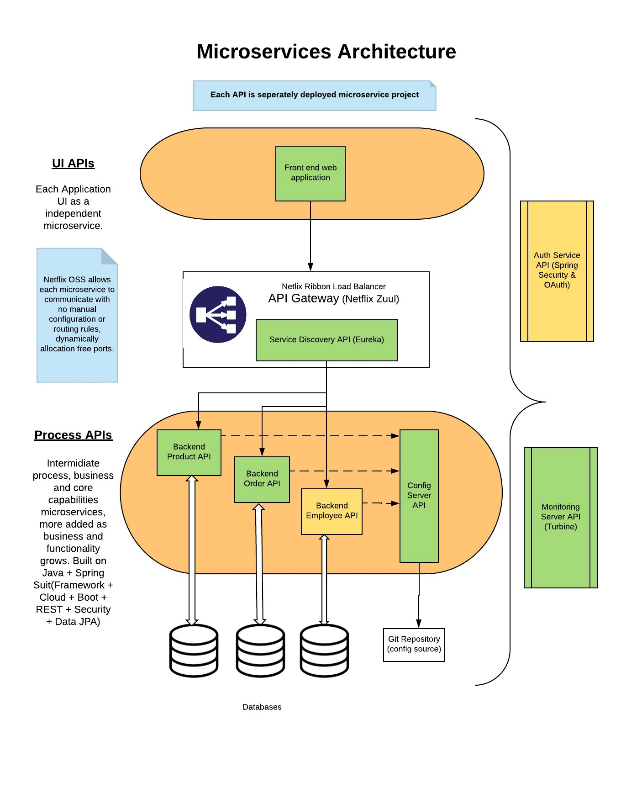
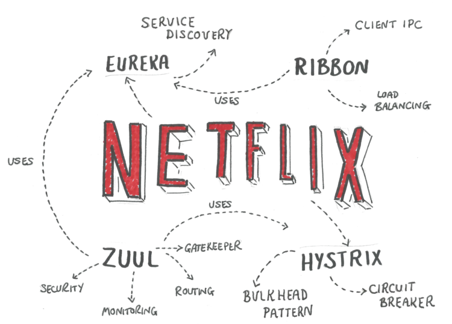
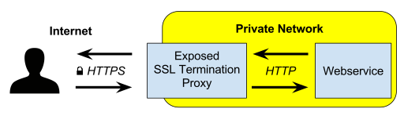

# API Gateway

## Introduction

### Micro-services architecture

- **Monolithic architectures**: *challenges*

    As application grows and code base grows, it overloads and reduced developer productivity.
    As everything is packaged in one EAR/WAR, we cannot change technology stack, refactoring code base is difficult.
    If any single function fails, the entire application goes down.
    If a particular function consumes more memory, entire application feels the pain.
    Scaling such a monolithic application can only be accomplished by deploying the same EAR/WAR packages in more servers — also known as horizontal scaling. Each copy of the application in various servers will utilize the same amount of underlying resources, which is often not an efficient way to design.

- **Micro-services**: *advantages*

    Decentralized, Independent, Do one thing well, Polyglot, Black box.
    Agility, scalability, availability, reusability.
    Improves fault isolation, Eliminates long-term commitment to a single technology stack, Code for different services can be written in different languages
    Makes it easier for a new developer to understand the functionality of a service, enables continuous delivery.

- **Micro-services**: *challenges*

    Just because something is all the rage around the industry, doesn’t mean it has no challenges. Here’s a list of some potential pain areas we realized.

  - Initial developing distributed systems can be complex.

  - Testing a micro-services-based application can be tricky as compared to monolithic approach.

  - Deploying micro-services can be complex initially.

Following there is a typical micro-service architecture:



### Spring Cloud and Netflix OSS

Spring Cloud is a project integrated inside the spring.io family with a set of components that can be used to implement our operations model. To a large extent Spring Cloud is based on components from **Netflix OSS**. Spring Cloud integrates the Netflix components in the Spring environment in a very nice way using auto configuration and convention over configuration similar to how Spring Boot works.



The table below maps the generic components in the operations model to the actual components that we will use throughout this blog series:


Following are described some of the components:

- **Netflix Eureka**: Service Discovery Server Netflix Eureka allows micro-services to register themselves at runtime as they appear in the system landscape.
- **Netflix Hystrix**: Hystrix is a latency and fault tolerance library designed to isolate points of access to remote systems, services and 3rd party libraries, stop cascading failure and enable resilience in complex distributed systems where failure is inevitableService for re-router and circuit breaker
- **Netflix Ribbon**: Dynamic Routing and Load Balancer Netflix Ribbon can be used by service consumers to lookup services at runtime. Ribbon uses the information available in Eureka to locate appropriate service instances. If more than one instance is found, Ribbon will apply load balancing to spread the requests over the available instances. Ribbon does not run as a separate service but instead as an embedded component in each service consumer.
- **Netflix Zuul**: Edge Server Zuul is (of course) our gatekeeper to the outside world, not allowing any unauthorized external requests pass through. Zulu also provides a well known entry point to the micro-services in the system landscape. Using dynamically allocated ports is convenient to avoid port conflicts and to minimize administration but it makes it of course harder for any given service consumer. Zuul uses Ribbon to lookup available services and routes the external request to an appropriate service instance. In this blog post we will only use Zuul to provide a well known entry point, leaving the security aspects for coming blog posts.

> Inside this solution we wil be using [Consul](https://github.com/hashicorp/consul) instead Eureka for the Service Discovery.

## Implementation

### Consul Server - Registration Service

To deploy a **Consul** server, basically start a Consul cluster using the default port 8500, so the clients can register later.

``docker-compose.yml``

```yaml
version: '3.5'

services:
  
  consul:
    image: bitnami/consul:latest
    ports:
    - 8500:8500
    networks:
    - gateway-network

networks:
  gateway-network:
    name: gateway-network
```

### Consul Service — Discovery

As long as Spring Cloud Netflix and Eureka Core are on the classpath any Spring Boot application with ``@EnableDiscoveryClient`` and ``spring-cloud-starter-consul-all`` dependency in *gradle.build* will try to contact a **Consul** server on http://consul:8500

Here is an example of configuration for any API so that Registry Server can discover the API:

``bootstrap.yml``

```yaml
spring:
  profiles:
    active: local
  application:
    name: catalog
  cloud:
    consul:
      retry:
        initial-interval: 1000
        max-interval: 2000
        max-attempts: 100
      discovery:
        prefer-ip-address: true
        service-name: ${spring.application.name}
        instanceId: ${spring.application.name}-${random.value}
        healthCheckPath: /actuator/health
        healthCheckInterval: 20s
        tags: profile=${spring.profiles.active}, version=${info.project.version:}
---
spring:
  profiles: local
  cloud:
    discovery:
      enabled: false
    consul:
      enabled: false
---
spring:
  profiles: docker
  cloud:
    consul:
      host: consul
      port: 8500

```

### Netflix Zuul — API Gateway

**Zuul** is our gatekeeper to the outside world, not allowing any unauthorized external requests pass through. Zuul also provides a well known entry point to the micro-services in the system landscape. Using **dynamically** allocated ports is convenient to avoid port conflicts and to minimize administration but it makes it of course harder for any given service consumer.

> In the current example, the **authorization** are delegated to the micro-services. So each micro-service must creates the necessary filter rules and also sets the ``@EnableResourceServer`` annotation, so it checks for the current JWT token to have enough privileges (based on Authorities or custom Jwt parameters) to access to that particular resource.

In order to build Zuul gateway, the micro-service that handles the UI need to be enabled with zuul config. We have to import the dependency ``spring-cloud-starter-zuul`` in *gradle.build* and enable it in application main class using ``@EnableZuulProxy`` annotation.

Zuul also support for **TLS termination** communication and other server modes. Since internal micro-services are supposed to be isolated from outside world, this can **increase** performances on internal communication.



Here is configuration for zuul gateway in ``application.yml`` file. We don’t have to mention the APIs ports or host names as we have already registered the APIs. The gateways will pick the route from Registry Server.

```yaml
spring:
  sleuth:
    sampler:
      probability: 1

management:
  endpoints:
    web.exposure.include: health,beans,env,info

logging:
  level:
    root: WARN
    org.springframework.web: INFO
    com.example: DEBUG

hystrix:
  command:
    default:
      execution:
        isolation:
          thread:
            timeoutInMilliseconds: 30000

security:
  require-ssl: true

authentication:
  symmetricKey: as466gf
  resourceId: application
  accessTokenValidity: 3600
  refreshTokenValidity: 21600
  authorities:
    basic:
      name: basic-client
      secret: password
    normal:
      name: normal-client
      secret: password
    trusted:
      name: trusted-client
      secret: password

zuul:
  sensitiveHeaders: Cookie,Set-Cookie
  ignoreSecurityHeaders: false
  ignoredServices: "*"
  prefix: /api
  host:
    max-total-connections: 1000
    max-per-route-connections: 100
  semaphore:
    max-semaphores: 500
  routes:
    customer:
      serviceId: customer
      path: /customer/**
    catalog:
      serviceId: catalog
      path: /catalog/**
    management:
      serviceId: management
      path: /management/**

ribbon:
  ConnectTimeout: 5000
  ReadTimeout: 5000
  maxAutoRetries: 2
  MaxAutoRetriesNextServer: 2

server:
  port: 8443
  error.whitelabel.enabled: false
  use-forward-headers: true
  ssl:
    enabled: true
    keyStoreType: JKS
    sslHostnameValidationEnabled: false
    keyAlias: keystore
    key-store: classpath:keystore.jks
    key-store-password: password
    key-password: password

---
spring:
  profiles: local
  zipkin:
    enabled: false
    locator:
      discovery:
        enabled: false

zuul:
  routes:
    customer:
      url: http://localhost:8081
    catalog:
      url: http://localhost:8082
    management:
      url: http://localhost:8083

management:
  ribbon:
    listOfServers: localhost:8083

---
spring:
  profiles: docker
  zipkin:
    base-url: http://zipkin:9411
    enabled: true
    locator:
      discovery:
        enabled: true

server:
  compression:
    enabled: true
    mime-types: text/html,text/xml,text/plain,text/css, application/javascript, application/json
    min-response-size: 1024
```

### Ribbon — Load Balancing

Zuul and micro-services uses Ribbon to lookup available services and routes the external request to an appropriate service instance.

```yaml
ribbon:
  ConnectTimeout: 5000
  ReadTimeout: 5000
  maxAutoRetries: 2
  MaxAutoRetriesNextServer: 2
  OkToRetryOnAllOperations: true
```

By default Ribbon uses round robbin to lookup for services available. If we want to handle load balancing ourselves, we can add the below to resolve the requests performed over management-api:

```yaml
management:
  ribbon:
    listOfServers: localhost:8083
```

### Netflix Hystrix

**Hystrix** implements the circuit breaker pattern. In a microservice architecture it is common to have multiple layers of service calls. With Hystrix we can handle each API call and its failover routing. One of the main benefits of Hystrix is the set of metrics it gathers about each **HystrixCommand**.


### Turbine

Looking at an individual instances Hystrix data is not very useful in terms of the overall health of the system. Turbine is an application that aggregates all of the relevant ``/hystrix.stream`` endpoints into a combined ``/turbine.stream`` for use in the Hystrix Dashboard. Individual instances are located via Eureka.

Here is its application.yaml configuration looks like for MONITORING-SERVER-API:

```yaml
server:
  port: 8070
turbine:
  appConfig: management,customer,catalog
```

### Hystrix Command

For any micro-service to enable **hystrix** circuit breaker. We need to import the dependency ``spring-cloud-starter-hystrix`` and for every REST API we enable using the annotation ``@EnableHystrix`` and ``@HystrixCommand``.

> We can add custom circuit break path in ``@HystrixCommand``

Here is its ``application.yaml`` configuration looks like for micro-services to register with monitoring server:

```yaml
hystrix:
  command:
    default: # Current Service Id: management,customer,catalog or default
      circuitBreaker:
        enabled: false
      execution:
        isolation:
          thread:
            timeoutInMillisecounds: 210000
        timeout:
          enabled: false
```

## References

- [Spring REST Controller](https://www.baeldung.com/spring-requestmapping)
- [Spring REST with a Zuul Proxy](https://www.baeldung.com/spring-rest-with-zuul-proxy)
- [Quick Guide to Spring Cloud - Consul](https://www.baeldung.com/spring-cloud-consul)
- [Guide to Spring Cloud Netflix - Hystrix](https://www.baeldung.com/spring-cloud-netflix-hystrix)
- [Spring Cloud – Tracing Services with Zipkin](https://www.baeldung.com/tracing-services-with-zipkin)
- [Rest Client with Netflix Ribbon](https://www.baeldung.com/spring-cloud-rest-client-with-netflix-ribbon)
- [HATEOAS - Hypertext as the Engine of Application State](https://www.baeldung.com/spring-hateoas-tutorial)
