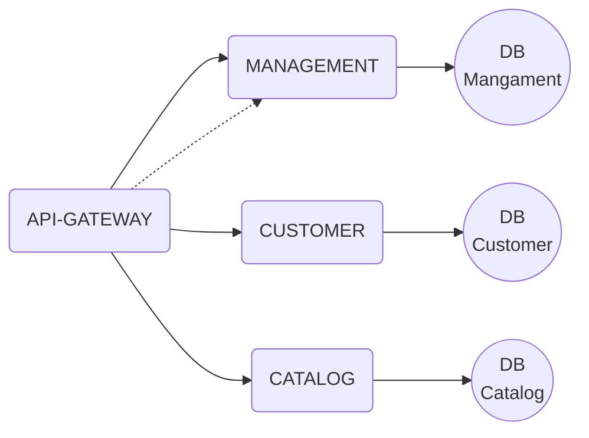

```mermaid
graph LR;

    GATEWAY(API-GATEWAY);
    MANAGEMENT(MANAGEMENT);
    CUSTOMER(CUSTOMER);
    CATALOG(CATALOG);

    DB_MANAGEMENT((DB<br>Mangament));
    DB_CUSTOMER((DB<br>Customer));
    DB_CATALOG((DB<br>Catalog));

    GATEWAY-->MANAGEMENT;
    GATEWAY-->CUSTOMER;
    GATEWAY-->CATALOG;

    GATEWAY-.->MANAGEMENT;

    MANAGEMENT--> DB_MANAGEMENT;
    CUSTOMER--> DB_CUSTOMER;
    CATALOG--> DB_CATALOG;


```