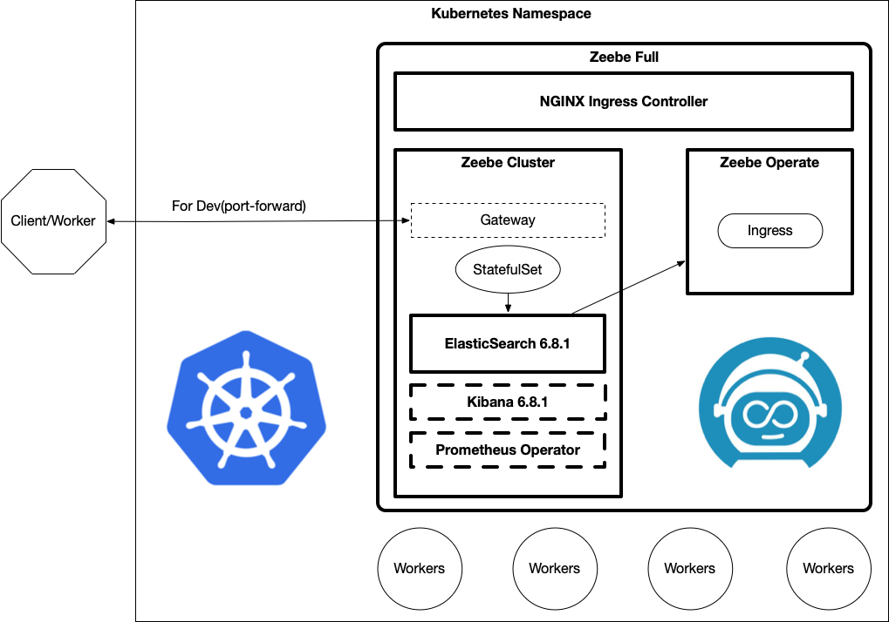
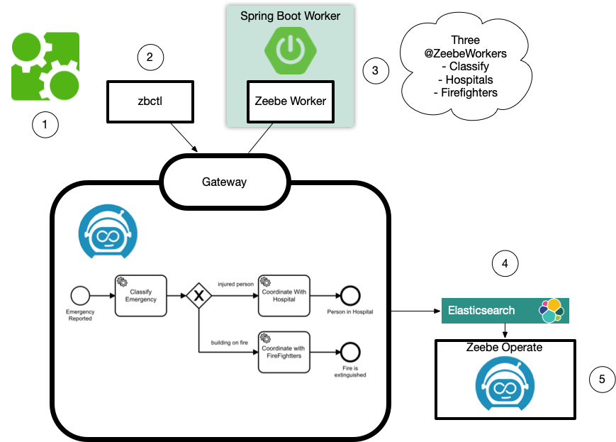
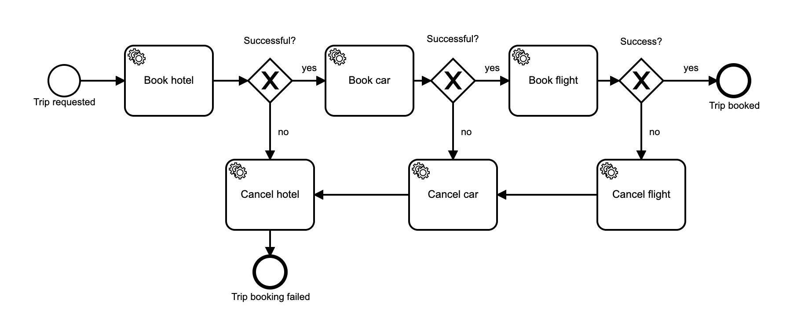

# Zeebe


With Zeebe you can:

* Define workflows graphically in BPMN 2.0
* Choose any gRPC-supported programming language to implement your workers
* Build workflows that react to events from Apache Kafka and other messaging platforms
* Use a SaaS offering or deploy with Docker and Kubernetes (in the cloud or on-premises)
* Scale horizontally to handle very high throughput
* Rely on fault tolerance and high availability for your workflows
* Export workflow data for monitoring and analysis
* Engage with an active community

## Installation



Zeebe is going to be installed in a Kubernetes cluster using Helm chart, since it is a non experimental method.

Requirements for the installation:

* Helm >= 3.x +
* Kubernetes >= 1.8
* Minimum cluster requirements include the following to run this chart with default settings. All of these settings are configurable.
  * Three Kubernetes nodes to respect the default "hard" affinity settings.
  * 1GB of RAM for the JVM heap

Follownig are the main repositories that are going to be used.

* [Zeebe Fulll Helm](https://github.com/zeebe-io/zeebe-full-helm). This is the main helm chart. This chart has some dependencies. Subcharts and other components such as elasticsearch, kibana, Prometheus, etc are needed in order to install Zeebe in a Kubernetes cluster.
* [Zeebe Profiles](https://github.com/zeebe-io/zeebe-helm-profiles). Some default profiles with vanilla configuration depending on the environment to be deployed

1. Clone Profiles repositories to customize some values depending on the environment.

     ```bash
    # Clone repository or directly use the URL with the profile (yaml) installing the HELM chart
    git clone https://github.com/zeebe-io/zeebe-helm-profiles.git
    ```

2. Setup Zeebe Helm repository

    ```bash
    helm3 repo add zeebe https://helm.camunda.io
    helm3 repo update
    ```

3. Install `Zeebe` using the dev profile wiith the minimaal installation (default namespace)

    ```bash
    helm3 install zeebe-dev zeebe/zeebe-full-helm -f kubernetes/zeebe-dev-profile.yaml

    # With custom values
    helm3 install zeebe-dev zeebe/zeebe-full-helm  --set zeeqs.enabled=true -f kubernetes/zeebe-dev-profile.yaml

    # Extract templates
    helm3 template zeebe-dev zeebe/zeebe-full-helm -f kubernetes/zeebe-dev-profile.yaml > helm-values.yaml
    ```

4. Check all the pods are running in the cluster.

    > Since it is the dev profile it must be just one replica per component installed.

    ```bash
    NAME                                                  READY   STATUS    RESTARTS   AGE
    elasticsearch-master-0                                1/1     Running   0          4m49s
    zeebe-dev-ingress-nginx-controller-69557db77c-fz9ln   1/1     Running   0          4m49s
    zeebe-dev-zeebe-0                                     1/1     Running   0          4m49s
    zeebe-dev-zeebe-gateway-67c9dc4446-dbcqh              1/1     Running   0          4m49s
    zeebe-dev-zeebe-operate-helm-f7c48f96c-km8xs          1/1     Running   0          4m49s
    ```

5. Check the services created

    ```bash
    elasticsearch-master                           ClusterIP      10.96.134.30     <none>        9200/TCP,9300/TCP              6m13s
    elasticsearch-master-headless                  ClusterIP      None             <none>        9200/TCP,9300/TCP              6m13s
    kubernetes                                     ClusterIP      10.96.0.1        <none>        443/TCP                        6d1h
    zeebe-dev-ingress-nginx-controller             LoadBalancer   10.97.9.104      localhost     80:32512/TCP,443:30663/TCP     6m13s
    zeebe-dev-ingress-nginx-controller-admission   ClusterIP      10.102.87.19     <none>        443/TCP                        6m13s
    zeebe-dev-zeebe                                ClusterIP      None             <none>        9600/TCP,26502/TCP,26501/TCP   6m13s
    zeebe-dev-zeebe-gateway                        ClusterIP      10.108.27.251    <none>        9600/TCP,26500/TCP             6m13s
    zeebe-dev-zeebe-operate-helm                   ClusterIP      10.109.176.158   <none>        80/TCP                         6m13s
    ```

6. Test `Zeebe Operate` using the loadbalancer created by the ingress controller. (http://localhost/#/login) (demo/demo)

    > If the LoadBalancer it is not available in the kubernetes cluster use `port-forward` or `NodePort` to access.

    ```bash
    # Bind the port from the current service 80 to the local 8080. http://localhost:8080/#/login
    kubectl port-forward svc/zeebe-dev-ingress-nginx-controller 8080:80
    ```

7. Communication inside the Cluster using `Zeebe Gateway`

    > In order to interact with the services inside the cluster you need to use port-forward to route traffic from your environment to the cluster.

    ```bash
    # This allows from dev to connect through the cluster using local java applications or Zeebe CLI
    kubectl port-forward svc/zeebe-dev-zeebe-gateway 26500:26500
    ```

## Workflows

* [Friendly Enough Expression Language](https://zeebe.io/blog/2020/09/feel/)

### Zeebe Modeler

In order to create and view Zeebe workflows, it is recommended to use the Tool `Zeebe Modeler`

1. Install [Zeebe Modeler](https://github.com/zeebe-io/zeebe-modeler/releases)

    ```bash
    # Using brew macosx
    brew cask install zeebe-modeler

    # Download and install from the releases github page
    wget https://github.com/zeebe-io/zeebe-modeler/releases/download/v0.11.0/zeebe-modeler-0.11.0-mac.dmg
    ```

2. Open a BPMN example

    ```bash
    # Clone following repository
    git clone https://github.com/salaboy/zeebe-k8s-getting-started.git

    # Open the file "emergency-process.bpmn" from Zeebe Modeler
    # Zeebe curren version has changed the format of the files. i.e 'emergencyType == "Fire"' > '= emergencyType = "Fire"'
    ```

3. Check the example and inspect the properties and types for the tasks

    * General: The `Id` (emergency-process) and the `Name` (Emergecy Process) of the process. General properties appear when no other item is selected
    * Tasks: `Classify Emergency`, `Coordinate With Hospital`, `Coordintate With Firefighters`
    * Types: `classify`, `hospital`, `firefighters`
    * Conditionals: Links between conditional task specify the expressions (`Condition Expression`) to match to decide the Taks to execute next.

    > In this example there are three **Task** or **Types**. Depending on the output `emergencyType` from `Classify Emergency`, the workflow will execute `Coordinate With Hospital` or `Coordintate With Firefighters`. Each Task Type will be executed by a Worker that implements that `Type`. A worker or instance can implement multiple tasks.

### Zeebe CLI

Zeebe CLI is the Command Line Interface. By default is configured to point to localhost:26500 to interact with a cluster, and because we are running port-forward from our environment to the cluster, our 26500 port is redirected to the cluster service.

1. Download CLI from [Zeebee releases page](https://github.com/zeebe-io/zeebe/releases)

    ```bash
    # Macos Version
    wget https://github.com/zeebe-io/zeebe/releases/download/0.26.0/zbctl.darwin
    chmod +x zbctl.darwin

    # Copy binary file into global so it can bee used from any location
    sudo mv zbctl.darwin /usr/local/bin/zbctl
    ```

2. Connect inside the Cluster using `Zeebe Gateway`

    ```bash
    # This allows from dev to connect through the cluster using local java applications or Zeebe CLI
    kubectl port-forward svc/zeebe-dev-zeebe-gateway 26500:26500
    ```

3. Test and get the current status

    ```bash
    # Since it is local we will use --insecure
    zbctl status --insecure

    # Following must be the output displaying the status of the cluster
    Cluster size: 1
    Partitions count: 1
    Replication factor: 1
    Gateway version: 0.26.0
    Brokers:
    Broker 0 - zeebe-dev-zeebe-0.zeebe-dev-zeebe.default.svc.cluster.local:26501
        Version: 0.26.0
        Partition 1 : Leader, Healthy
    ```

## Demo



1. Connect to the Zeebe Cluster.

    In order to interact with the services inside the cluster you need to use `port-forward` to route traffic from your environment to the cluster. 

    ```bash
    kubectl port-forward svc/zeebe-dev-zeebe-gateway 26500:26500
    ```

2. Once you have your connection to your cluster you can deploy our process definition by running:

    ```bash
    zbctl deploy workflows/emergency-process.bpmn --insecure

    # This is the output when the workflow has been deployed
    {
        "key": 2251799813685250,
        "workflows": [
            {
            "bpmnProcessId": "emergency-process",
            "version": 1,
            "workflowKey": 2251799813685249,
            "resourceName": "emergency-process.bpmn"
            }
        ]
    }

    # This will deploy another version. THe version is automatically incremented
    zbctl deploy workflows/emergency-process-v2.bpmn --insecure

    zbctl deploy workflows/emergency-process-v3.bpmn --insecure
    ```

3. Check current workflow within the Zeebe Operator at (http://localhost/#/).

   > the `emergency-process` must appear in the dashboard with Zero instances yet

4. Create Workflow Instances.

    > When creating instances it is possible to add variables

    ```bash
    # Create an instance where emergencyReason = "person"
    zbctl create instance emergency-process --variables "{\"emergencyReason\" : \"person\"}" --insecure

    # Create an instance where emergencyReason = "building on fire" 
    zbctl create instance emergency-process --variables "{\"emergencyReason\" : \"building on fire\"}" --insecure

    # This is the output when both instances have been created
    {
        "workflowKey": 2251799813685249,
        "bpmnProcessId": "emergency-process",
        "version": 1,
        "workflowInstanceKey": 2251799813685251
    }

    {
        "workflowKey": 2251799813685249,
        "bpmnProcessId": "emergency-process",
        "version": 1,
        "workflowInstanceKey": 2251799813685258
    }
    ```

5. Check current workflow within the Zeebe Operator at (http://localhost/#/).

    > At this point, you will see that they are both stuck at the `Classify Emergency` task. This is because you don't have workers for such tasks, so the process will wait in that state until we provide one of these workers.

6. Starting a simple Spring Boot Zeebe Worker

    ```bash
    cd  zeebe-worker-spring-boot-example/
    mvn spring-boot:run
    ```

7. Starting a simple Spring Boot Zeebe Worker

    > The worker is configured by default to connect to `localhost:26500` to fetch Jobs. If everything is up and running the worker will start and connect, automatically completing the pending tasks in our Workflow Instances.

8. Check current instances status

    > If you refresh Operate (http://localhost:80) you will find both Instances completed. Check Finished Instances to show the finished instances. In the graph, the terminal nodes show the number and final statuses (succesfull).

## DEMO Sync

1. Deploy a local Zeebe environment for development using docker-compose

    ```bash
    # run docker compose
    docker-compose -f docker/docker-compose.yml up
    ```

2. Deploy `emergency-process-v2`into local >eebe cluster

    ```bash
    # Deploy bpmn version 2
    zbctl deploy workflows/emergency-process-v2.bpmn --insecure  
    ```

3. Open and run `zeebe-rest-spring-boot`

4. Test Following endpoints

    ```bash
    # Returns an object of type 'Injured'
    curl http://localhost:8081/classify/person

    # Returns an object of type 'Fire'
    curl http://localhost:8081/classify/fire

    # Returns a Server Internal Error due a timeout
    curl http://localhost:8081/classify/retries

    # Returns a HTTP 404 Not Found Error due a the reason does not exists
    curl http://localhost:8081/classify/reason
    ```

5. Verify current calls using Zeebe Operate.

## DEMO EVENTS


1. Deploy a local Zeebe environment for development using docker-compose

    ```bash
    # run docker compose
    docker-compose -f docker/docker-compose.yml up
    ```

2. Deploy `emergency-process-v2`into local >eebe cluster

    ```bash
    # Deploy bpmn version 2
    zbctl deploy workflows/emergency-process-v3.bpmn --insecure  
    ```

3. Open and run `zeebe-rest-spring-boot`

4. Test Following endpoints

    > Since both request are synchronous both are going to return Internal Server Error because a Timeout

    ```bash
    # Returns an object of type 'Injured'
    curl http://localhost:8081/classify/person

    # Returns an object of type 'Fire'
    curl http://localhost:8081/classify/fire
    ```

5. Publish Message Event to Zeebe so it continues with the workflow

    > Check dashboard to check messages moves from the event node to the final.

    ```bash
    # Returns an object of type 'Injured'
    zbctl publish message "emergency-received" --correlationKey="person" --insecure 

    # Returns an object of type 'Fire'
    zbctl publish message "emergency-received" --correlationKey="fire" --insecure 
    ```

6. Verify current calls using Zeebe Operate.

## DEMO SAGA

