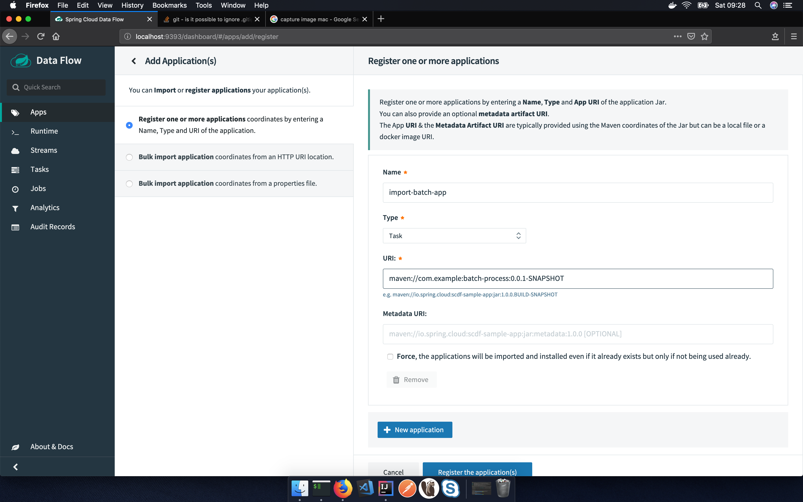
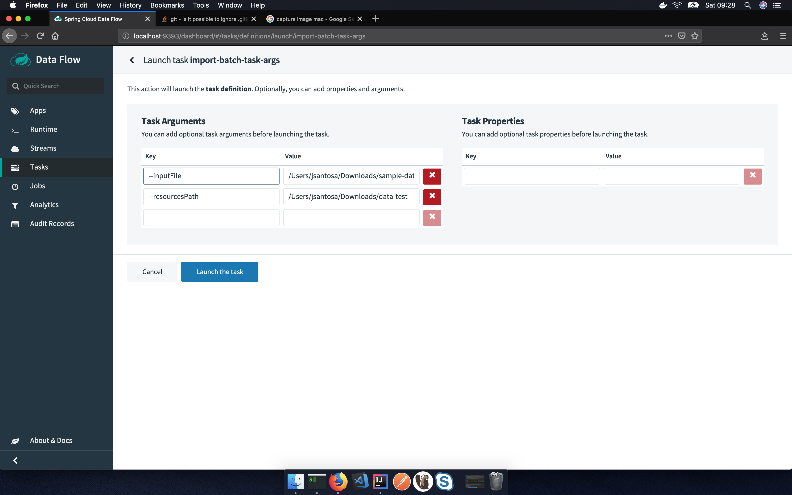

# Spring Cloud Task

## Usage

1. Copy the zip file `sample-data.zip` into `"C:\test\"`, `"/Users/jsantosa/Downloads"`, or whatever foder you want.
1. Use `gradle build` to create all the packages.
1. Run `gradle install` to publish maven artifact locally (using `maven` plugin)
   > Check generated artifact `com\example\batch-process\0.0.1-SNAPSHOT\batch-process-0.0.1-SNAPSHOT.jar`
1. Then deploy the `docker-compose` file inside the project. (Run MySQL and PostgreSQL instances)
1. Run `db-migration` project and `rest-service`. 

## Dataflow Server (local)

- **Download** the Spring Cloud Data Flow Server (local) and Shell apps:

        wget http://repo.spring.io/milestone/org/springframework/cloud/spring-cloud-dataflow-server-local/1.7.4.RELEASE/spring-cloud-dataflow-server-local-1.7.4.RELEASE.jar

        wget http://repo.spring.io/milestone/org/springframework/cloud/spring-cloud-dataflow-shell/2.0.1.RELEASE/spring-cloud-dataflow-shell-2.0.1.RELEASE.jar

- Launch the Data Flow Server

    > Since the Data Flow Server is a Spring Boot application, you can run it just by using java -jar.

    ```bash
    java -jar spring-cloud-dataflow-server-local-1.7.4.RELEASE.jar

    java -jar spring-cloud-dataflow-server-local-1.7.4.RELEASE.jar --spring.datasource.url=jdbc:mysql://dockerhost:3306/db --spring.datasource.username=root --spring.datasource.password=password --spring.datasource.driver-class-name=org.mariadb.jdbc.Driver
    ```

    Other options

    ```bash
    --spring.rabbitmq.host=127.0.0.1 --spring.rabbitmq.port=5672 --spring.rabbitmq.username=guest --spring.rabbitmq.password=guest
    ```

    > Check the drivers supported by data flow server at [link](https://docs.spring.io/spring-cloud-dataflow/docs/1.2.4.BUILD-SNAPSHOT/reference/html/configuration-rdbms.html)

    > Server runs at http://localhost:9393 (/dasboard)

- Launch the shell:

        java -jar spring-cloud-dataflow-shell-2.0.1.RELEASE.jar

        java -jar C:\Users\jsantosa\Downloads\spring-cloud-dataflow-shell-2.0.1.RELEASE.jar

> If the Data Flow Server and shell are not running on the same host, point the shell to the Data Flow server URL:

    server-unknown:>dataflow config server http://localhost
    Successfully targeted http://localhost
    dataflow:>

## Usage

### Add Application

Compose the maven URI with the metadata file generate in maven repository

```xml
<groupId>com.example</groupId>
<artifactId>batch-process</artifactId>
<version>0.0.1-SNAPSHOT</version>
```

URI: `maven://com.example:batch-process:0.0.1-SNAPSHOT`



### Crate Task

Create task from app definition (task type)


### Launch the task

Launch the task normally

    java -jar batch-process-0.0.1-SNAPSHOT.jar --inputFile=/Users/jsantosa/Downloads/sample-data.zip --resourcesPath=/Users/jsantosa/Downloads/data

    java -jar batch-process-0.0.1-SNAPSHOT.jar --inputFile=/Users/jsantosa/Downloads/sample-data-test.zip --resourcesPath=/Users/jsantosa/Downloads/data-test

Using the dashboard is needed to pass the initial paremeter as key value pair
    
| key | value |
| --  |  --   |
| `--inputFile`  |  `/Users/jsantosa/Downloads/sample-data-test.zip`   |
| `--resourcesPath`  |  `/Users/jsantosa/Downloads/data-test`  |  

 


## References

[Deploying Spring Cloud Data Flow Local Server](https://docs.spring.io/spring-cloud-dataflow/docs/1.2.0.M1/reference/html/getting-started-deploying-spring-cloud-dataflow.html)
[Getting started with spring data flow](https://www.e4developer.com/2018/02/18/getting-started-with-spring-cloud-data-flow/)