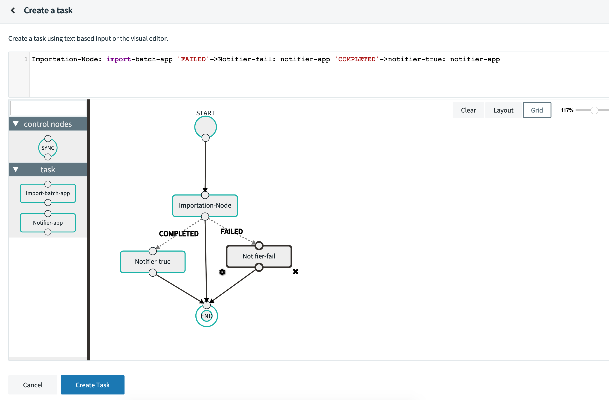
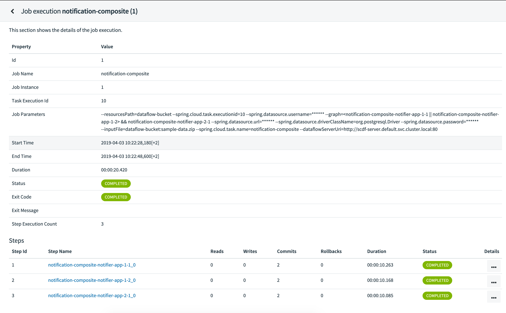

# Spring Cloud Task


## Jib

- **Build** the docker image locally

        gradle jibDockerBuild

- **Push** the image to the repository

        gradle jib

## Deployment

### Docker Compose

1. Use `gradle build` to create all the packages.
1. Run `gradle install` to publish maven artifact locally (using `maven` plugin)
   > Check generated artifact `com\example\batch-process\0.0.1-SNAPSHOT\batch-process-0.0.1-SNAPSHOT.jar`
1. Start docker compose to deploy all the services locally

    ```bash
    # Run docker clean to cleanup all the cache within docker engine
    ./docker-clean
    
    # Run docker compose to start all the services
    docker-compose up
   ```
    
1. Verify the connection to following services and database

    - [Minio Server](http://dockerhost:9001/minio/dataflow-bucket/)
    - [Rest Service Server](http://dockerhost:8080/departments/1)

1. Download and Start Data Flow Server locally

        # Download local dataflow server
        wget http://repo.spring.io/milestone/org/springframework/cloud/spring-cloud-dataflow-server-local/1.7.4.RELEASE/spring-cloud-dataflow-server-local-1.7.4.RELEASE.jar

        # Download command shell to use with datfalow
        wget http://repo.spring.io/milestone/org/springframework/cloud/spring-cloud-dataflow-shell/1.7.4.RELEASE/spring-cloud-dataflow-shell-1.7.4.RELEASE.jar

        # Launch dataflow server using the same postgreSQL connection previously deployed
        java -jar spring-cloud-dataflow-server-local-1.7.4.RELEASE.jar --spring.datasource.url=jdbc:postgresql://dockerhost:5432/dataflow --spring.datasource.username=postgres --spring.datasource.password=password --spring.datasource.driver-class-name=org.postgresql.Driver

        # Launch the integrated shell
        java -jar spring-cloud-dataflow-shell-1.7.4.RELEASE.jar --dataflow.uri=http://dockerhost:9393

1. Server runs at [Data flow server dashboard](http://localhost:9393/dashboard)

1. Add the task Applications:

   - maven://com.example:batch-process:0.0.1-SNAPSHOT
   - maven://com.example:task-notifier:0.0.1-SNAPSHOT
   - maven://com.example:batch-uploader-k8s:0.0.1-SNAPSHOT
  
   ```bash
    app register --name composed-task-runner --type task --uri maven://org.springframework.cloud.task.app:composedtaskrunner-task:2.1.0.RELEASE
    app register --name batch-process-app --type task --uri maven://com.example:batch-process:0.0.1-SNAPSHOT
    app register --name task-notifier-app --type task --uri maven://com.example:task-notifier:0.0.1-SNAPSHOT
    app register --name batch-uploader-app --type task --uri maven://com.example:batch-uploader-k8s:0.0.1-SNAPSHOT
  
    app list
    ```
    
1. Crate Task from app definition (task type)

    ```bash
    task create --name batch-process-task --definition "batch-process-app"
    task create --name task-notifier-task --definition "task-notifier-app"
    task create --name batch-uploader-task --definition "batch-uploader-app"
    ```bash

1. Using the dashboard is needed to pass the initial paremeters as key value pair
    
        --inputFile=dataflow-bucket:sample-data.zip
        --resourcesPath=dataflow-bucket
        
         task launch --name batch-process-task --arguments "--inputFile=dataflow-bucket:sample-data.zip --resourcesPath=dataflow-bucket"
            
1. Add following app inside Spring Data-flow server, to support composite tasks

    - Name: composed-task-runner	
    - Type: task
    - Maven: maven://org.springframework.cloud.task.app:composedtaskrunner-task:2.1.0.RELEASE
    
> Current version of server and composedtaskrunner is necessary to pass the following parameter to the composite task runner.

    --spring.cloud.dataflow.server.uri=http://localhost:9393
    --spring.datasource.url=jdbc:postgresql://dockerhost:5432/dataflow 
    --spring.datasource.username=postgres 
    --spring.datasource.password=password 
    --spring.datasource.driver-class-name=org.postgresql.Driver
    
    
    task launch --name composite-task --arguments "--spring.jpa.database-platform=org.hibernate.dialect.PostgreSQL9Dialect --spring.jpa.properties.hibernate.temp.use_jdbc_metadata_defaults=false --spring.cloud.dataflow.server.uri=http://localhost:9393 --spring.datasource.url=jdbc:postgresql://dockerhost:5432/dataflow --spring.datasource.username=postgres --spring.datasource.password=password --spring.datasource.driver-class-name=org.postgresql.Driver"
    
                     
### Kubernetes

#### Minikube

- Install `minikube` and `kubectl` following the instructions for the OS.
- Start `minikube`

   > Use settings to configure the memory, cpu, and other features.
   
        minikube start
    
- Verify the installation of `minikube`
    
        kubectl config current-context
        kubectl get nodes
        kubectl get pods,svc --all-namespaces

- Install `helm`

        # Install Helm
        curl https://raw.githubusercontent.com/helm/helm/master/scripts/get | bash
        # Init Helm
        helm init
        helm version
         
- Install `kompose`

        # Linux
        curl -L https://github.com/kubernetes/kompose/releases/download/v1.18.0/kompose-linux-amd64 -o kompose
        # macOS
        curl -L https://github.com/kubernetes/kompose/releases/download/v1.18.0/kompose-darwin-amd64 -o kompose
        
        chmod +x kompose
        sudo mv ./kompose /usr/local/bin/kompose
        
#### Kompose

Create the services needed to deploy the same initial services we have in previous environment using docker-compose`


#### Deployment

Deploy previous services and deployments

- Create the services, with the requirements for dataflow 

        kubectl apply -f .

- Create datasource and dependencies (except database, previously deployed)

        kubectl apply -f .

- Perform some migration and bootstrapping

        kubectl apply -f db-migration-job.yaml --force=true
        
- Verify pods are successfully deployed

        kubectl get pods,svc
        
- Check if dataflow dashboard is accessible
        
        http://localhost:32247/dashboard

#### Spring Batch DataFlow Task

In order to work are necessary some changes to be done.

- Use `Spring-cloud-deployer-kubernetes` as dependency instead using local.
- Use a docker image as the resource representing the worker. 
- Remove the passing of the environment variables to the worker (more on that in a moment).
- Check kubernetes is used for default launcher in [Spring data-flow server](http://localhost:32247/management/info)        


#### SETUP

- Create a new bucket into **minio**: `dataflow-bucket`
- Add file into previous bucket: `sample-data.zip`


#### Launching Task

- Perform a single test prior to launch the example to verify everything is working as expected

        app register --type task --name timestamp --uri docker:springcloudtask/timestamp-task:2.0.0.RELEASE --metadata-uri maven://org.springframework.cloud.task.app:timestamp-task:jar:metadata:2.0.0.RELEASE
        task create task1 --definition "timestamp"
        task launch task1

- Create a new application, using the generated docker image

        app register --type task --name batch-process-app --uri docker:jsa4000/dataflow-batch-process-k8s:0.0.1-SNAPSHOT
        app register --type task --name notifier-app --uri docker:jsa4000/dataflow-task-notifier:0.0.1-SNAPSHOT
        
        task create batch-process-task --definition "batch-process-app"
        task create notifier-task --definition "notifier-app"
          
        task launch batch-process-task      
        task launch notifier-task 
        
- Use the following parameters to launch the task (`create batch-process-task`)

        --inputFile=dataflow-bucket:sample-data.zip
        --resourcesPath=dataflow-bucket 
        
        --inputFile=dataflow-bucket:sample-data.zip --resourcesPath=dataflow-bucket

- Destroy the task

        task destroy --name task-test
        
#### Composed Tasks

Spring Cloud Data Flow allows a user to create a directed graph where each node of the graph is a task application. This is done by using the DSL for composed tasks. A composed task can be created via the RESTful API, the Spring Cloud Data Flow Shell, or the Spring Cloud Data Flow UI.

   

Out of the box the Composed Task Runner application is not registered with Spring Cloud Data Flow. So, to launch composed tasks we must first register the Composed Task Runner as an application with Spring Cloud Data Flow as follows:

Firstly add following app inside Spring Data-flow server;

- Name: composed-task-runner	
- Type: task
- Docker: docker:springcloudtask/composedtaskrunner-task:2.1.0.RELEASE
- [LOCAL] Maven: maven://org.springframework.cloud.task.app:composedtaskrunner-task:2.1.0.RELEASE

Create the composition task from the previous two already created, plus the `composed-task-runner`

    Importation-Node: import-batch-app 'FAILED'->Notifier-fail: notifier-app 'COMPLETED'->notifier-true: notifier-app 

Launch the task with the following arguments:
 
 > It must be **specified** the URL where data-flow server is located. 
 
    task launch --name composed-task --arguments "--dataflow-server-uri=http://scdf-server.default.svc.cluster.local:80"

 > It can be specified also at server side within the env variable `SPRING_CLOUD_DATAFLOW_SERVER_URI`
   
Also, specify other values specific for the inputs:

        --inputFile=dataflow-bucket:sample-data.zip
        --resourcesPath=dataflow-bucket
        
        # If not included at Spring Cloud Dataflow server
            --dataflow-server-uri=http://scdf-server.default.svc.cluster.local:80
        
        --inputFile=dataflow-bucket:sample-data.zip --resourcesPath=dataflow-bucket --dataflow-server-uri=http://scdf-server.default.svc.cluster.local:80

- Useful commandos:

        max-wait-time: 

   

Links:

  - [Official Github repository](https://github.com/spring-cloud-task-app-starters/composed-task-runner/blob/master/spring-cloud-starter-task-composedtaskrunner/README.adoc)
  - [Reference Composed Task](https://docs.spring.io/spring-cloud-dataflow/docs/1.2.0.RELEASE/reference/html/spring-cloud-dataflow-composed-tasks.html)
  - [Docs Composited Tasks](http://docs.spring.io/spring-cloud-dataflow/docs/1.2.0.BUILD-SNAPSHOT/reference/htmlsingle/#spring-cloud-dataflow-composed-tasks)  
  
#### Known issues

- Too many connections in PostgreSQL

```sql
SELECT *
FROM   pg_settings
WHERE  name = 'max_connections';
```

```yml
version: '2'
services:
  postgres:
    image: postgres:10.3-alpine
    command: postgres -c 'max_connections=200'
    environment:
      POSTGRES_DB: pgdb
      POSTGRES_PASSWORD: postgres
      POSTGRES_USER: postgres
    stdin_open: true
    tty: true
    ports:
    - 5432:5432/tcp
WHERE  name = 'max_connections';
```    
     
- To enter into a container currently running.

        kubectl exec batchjobtask-394317zg6p -i -t -- sh     
     
#### References

- [Spring Cloud Dataflow releases](http://repo.spring.io/milestone/org/springframework/cloud/)
- [Spring data flow with kubernetes](https://labnotes.panderalabs.com/spring-cloud-data-flow-and-docker-kubernetes-99a19f2dbab3)
- [Spring Cloud Deployer Kubernetes](https://github.com/spring-cloud/spring-cloud-deployer-kubernetes)
- [Routine Jobs with Kubernetes,](https://medium.com/pismolabs/routine-jobs-with-kubernetes-spring-cloud-dataflow-and-spring-cloud-task-d943bf107a8)
- http://what-when-how.com/Tutorial/topic-194n8n2/Spring-Batch-54.html
- https://github.com/spring-cloud-task-app-starters/timestamp-batch
- https://repo.spring.io/release/org/springframework/cloud/
- https://stackoverflow.com/questions/54627261/spring-cloud-task-app-composed-task-runner-doesnt-shutdown